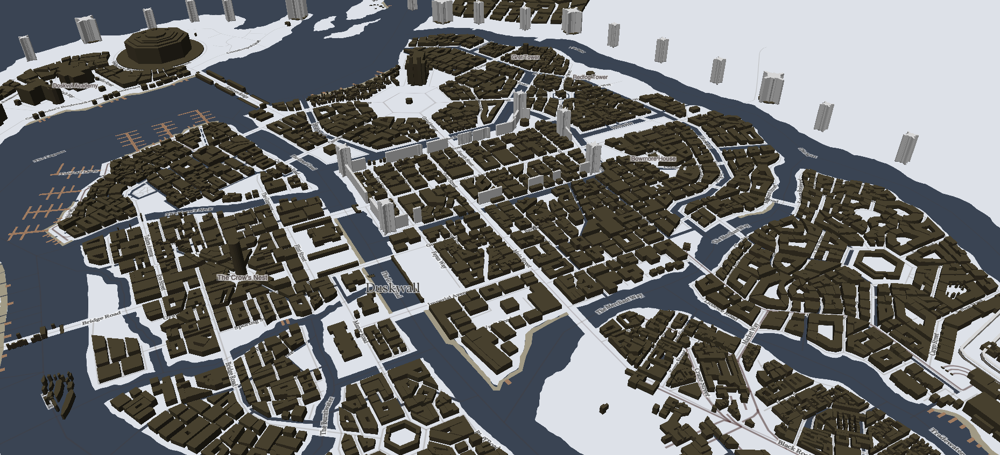
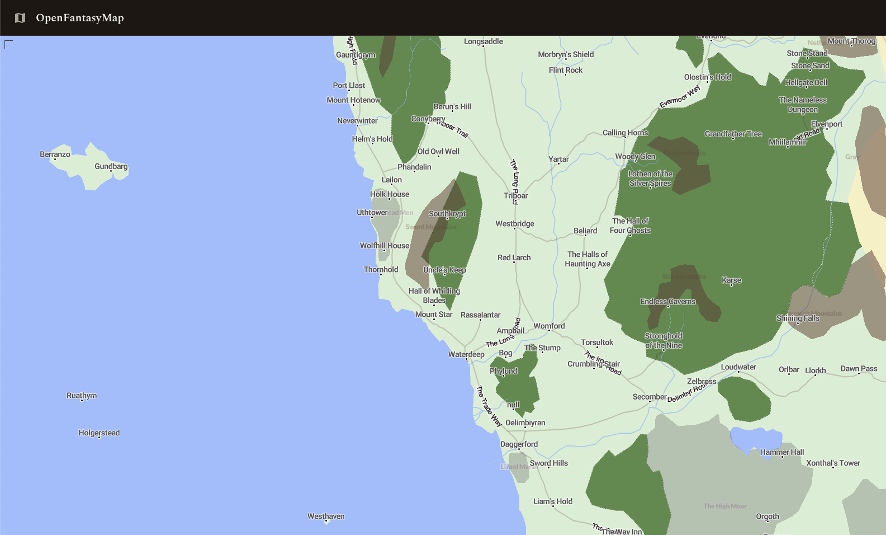
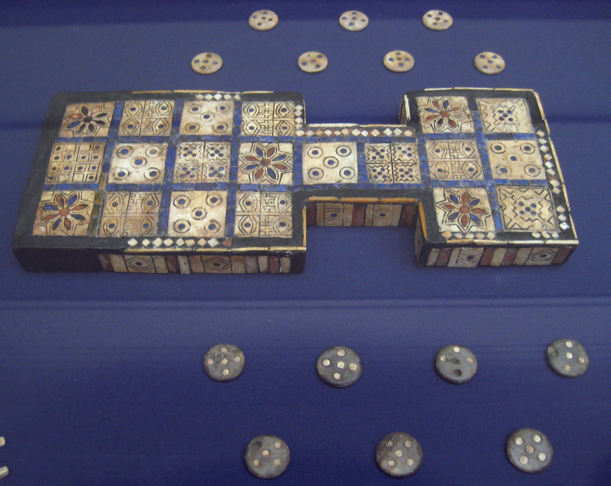
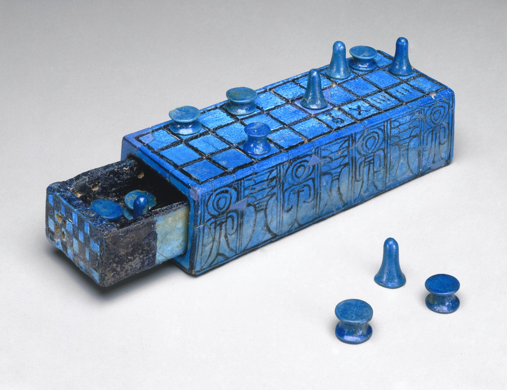
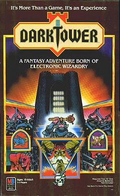
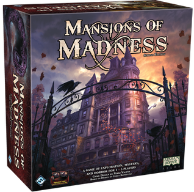
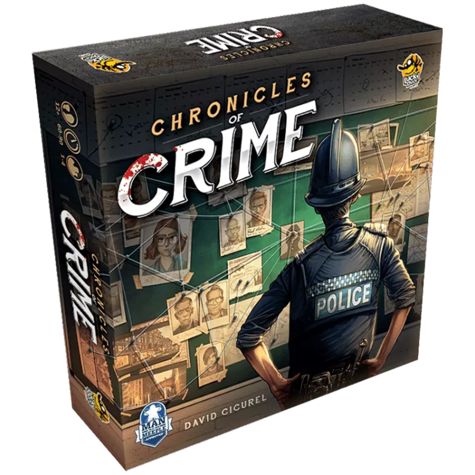
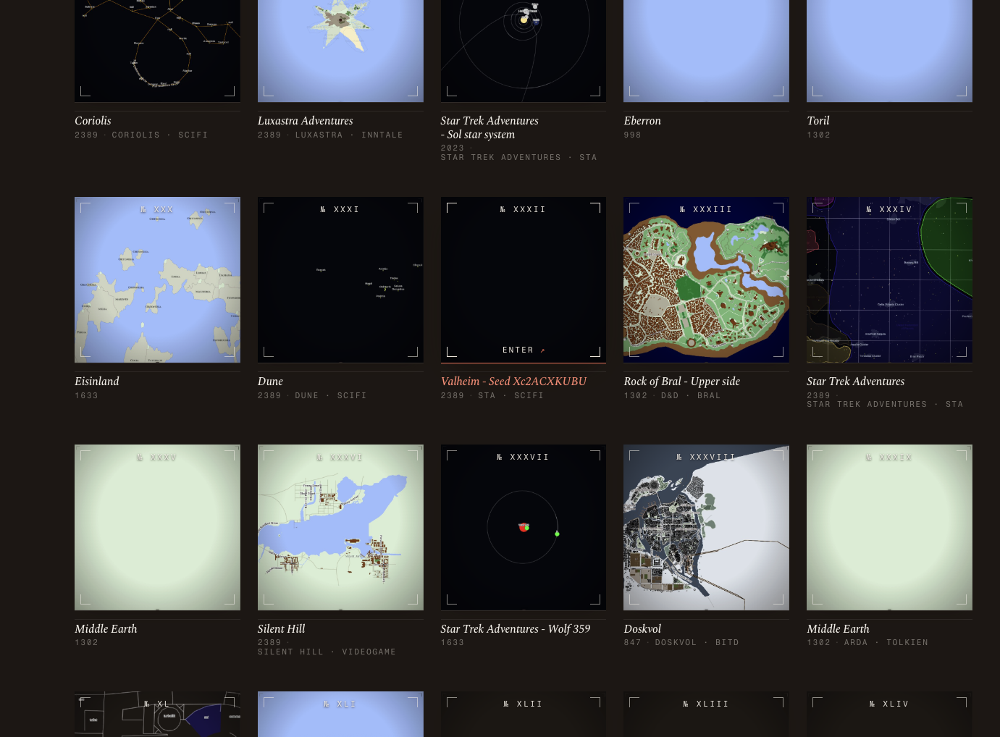

<!--
============================================================
TALK OUTLINE — MARP MARKDOWN
Title: Inside Board Game Publishing — Editorial Process,
       Post-2020 Economics, and Computer-Aided Games
Venue: Free University of Bozen-Bolzano · Game Design course
Duration: 75 min slides + 15 min Q&A
Language: English (slides + speaker notes)

TO FILL BEFORE DELIVERY:
  - Italian Prototype Scene (IdeaG slide): drop in 1-2 personal stories live
  - Slide 5: short anecdote about a design constraint conversation
  - Slide 34: contact info / handle
  - Verify Asmodee acquisition number (slide 18) closer to date
  - Decide whether to drop one slide if pace runs long
============================================================
-->

<!-- _class: title -->
<!-- _paginate: false -->

# Inside Board Game Publishing
## Editorial Process, Post-2020 Economics, and Computer-Aided Games

**Marco Montanari**
TTRPG publisher · rpg-schema researcher · GaiaWM

<!--
Thank the faculty for the invitation following the hospitality-mcp session.
Quick reframe: today is not about MCP servers — it's about something many of you may end up designing for, but few think of as a *business*: the boardgame as an editorial product.
Structure: a quick field-guide act, then three main acts, plus Q&A. 75 minutes of slides. Stop me if anything is unclear.
-->

---

<!-- _class: whoami -->

# Who am I, briefly

<figure class="bgg-card">
  
  <figcaption>BoardGameGeek · @sirmmo</figcaption>
</figure>

- **Publisher** — TTRPG one-shots with Public History background (Vespri 1282, Genova 1507, Killing Games series)
- **Researcher** — rpg-schema.org, tcg-schema.org · open ontologies for game content
- **Builder** — GaiaWM, a world-state engine for game agents, OpenHistoryMap, OpenFantasyMaps
- **In the network** — Mensa Ludo, Mensa Ludo Genesis, IdeaG, IdeaG-RPG
- **Find me** — BoardGameGeek [@sirmmo](https://boardgamegeek.com/user/sirmmo)

<!--
Establish credibility briefly — I'm not selling anything.
Position: I sit in three rooms — designer, publisher, and tech researcher. Most talks come from only one of these rooms; the interesting material sits at the joints.
-->

---

<!-- _class: worlds -->
<!-- _header: "" -->

# Two worlds — hold the thought

  <figure>
    
    <figcaption>Doskvol — the haunted industrial city of <em>Blades in the Dark</em></figcaption>
  </figure>
  <figure>
    
    <figcaption>Faerûn — the Sword Coast of <em>Dungeons &amp; Dragons</em></figcaption>
  </figure>

Two completely different fictions, both from OpenFantasyMaps. **Keep them in your pocket — we come back to them at the very end.**

<!--
Planted seed for a callback. Do NOT explain how they're made here — that's the payoff at the "One engine, many fictions" slide near the close.
Just: "a grimy industrial city and a high-fantasy coastline — totally different worlds, same toolchain. Hold that thought." ~20 seconds, then move on before anyone asks how.
-->

---

# What this talk is

Three things they don't usually teach in a game design class:

1. **The editorial filter** — what publishers actually change about your design
2. **Post-2020 economics** — why every box now costs €25 instead of €15
3. **Computer-Aided Games** — physical games are quietly becoming hybrid products, and AI is just the latest tool inside that shift

<!--
Frame: design school teaches mechanics and theme. Industry teaches you that mechanics meet manufacturing, distribution, and now ongoing software.
Act 1 is a quick primer (~3 min). Acts 2-4 are ~20-25 min each. Closing + Q&A 15 min.
Promise: by the end, you'll know roughly what happens to a design between "I have an idea" and "it's on a shelf at Feltrinelli."
-->

---

<!-- _class: lead -->

# Act 1
## A Field Guide

What a game really is — and how we'll talk about it

<!-- Section divider. Quick orientation pass. Sets the deep frame, then the vocabulary. -->

---

<!-- _class: ancient -->

# An Ancient Industry

Games are among the oldest manufactured goods we have — finished, sold, and replayed for **five thousand years**.

  <figure>
    
    <figcaption>Royal Game of Ur · ~2600 BCE · British Museum</figcaption>
  </figure>
  <figure>
    
    <figcaption>Senet · board ~1390 BCE, game attested ~3000 BCE · Brooklyn Museum</figcaption>
  </figure>

**Dice** turn up in nearly every excavated culture. Go, Nard, and Mancala each survived centuries — chess is the latecomer, barely ~1,500 years old.

<!--
Dates are approximate and contested — say so if pressed. The point isn't precision, it's depth: this is not a young industry chasing a fad.
The Royal Game of Ur is the strongest single artifact — a complete, mass-produced, rules-stable product four and a half thousand years before Kickstarter. The British Museum has its original ruleset on a cuneiform tablet.
The Senet board shown is Amenhotep III's faience set (~1390 BCE); the game itself goes back to ~3000 BCE predynastic Egypt.
~90 seconds.
-->

---

# What's Actually Being Sold

The components change every century. The product never does.

A game competes for the one resource every modern industry now fights over: **human attention** — and the **flow** it can produce.

- Cardboard, miniatures, an app — those are only delivery mechanisms
- What people pay for is a reliable path into **flow**: absorption, agency, challenge tuned just past comfort
- Which puts boardgames in the **same market as streaming, mobile games, and social feeds** — all selling our attention back to us

A designer is, in the end, building an **attention machine**. Everything else in this talk follows from that.

<!--
"Flow" = Csíkszentmihályi — full absorption, challenge matched to skill. University audience will know the term; name-drop it briefly.
The reframe that matters: the competition isn't other boardgames, it's everything else on the table-for-attention — phones, streaming, sleep. That's why production values and price have risen (Acts 2-3) and why the digital layer is tempting (Act 4).
This slide is the conceptual hinge of the whole talk — don't rush it. ~2 minutes.
-->

---

# What "Board Game" Means Here

Five axes you mostly already know — naming them so we share a vocabulary for the rest of the talk.

- **Weight** — filler · gateway · mid-weight · heavy strategy
- **Genre** — Euro (efficiency, low conflict) · thematic / *"Ameritrash"* (story, dice, drama) · abstract · party · dexterity
- **Mechanic family** — worker placement · deck-building · area control · drafting · engine-building · social deduction
- **Interaction** — competitive · cooperative · semi-cooperative · solo · legacy / campaign
- **Audience tier** — family · gateway · hobbyist · expert / collector

<!--
60-75 seconds total. Don't lecture — name the axes, point at where they overlap, move on.

Key bridge to make verbally: the publisher's brief lives where these axes intersect. The AUDIENCE TIER is the axis that drives everything in Acts 2-4 — price, print run, component budget, distribution channel. The other four describe what the game IS; audience tier describes who it's FOR, and that's the one publishers underwrite against.

If pace runs long, this whole slide is the natural cut.
-->

---

<!-- _class: lead -->

# Act 2
## The Publisher's Perspective

How an idea becomes a product on a shelf

<!-- Section divider. 15-20 seconds — orient and move on. -->

---

# Designer ≠ Publisher

Different incentive functions.

- **Designer** optimizes for: elegance, novelty, "the game I want to play"
- **Publisher** optimizes for: print-run economics, shelf presence, replay rate, brand fit, licensing potential

The publisher's first question is rarely *"is it fun?"*
It's *"is it fun enough given what it will cost to make and sell?"*

<!--
ANECDOTE SLOT — to fill: a real conversation with Sartor / Casto / Massa or another producer about a design that "could not exist as proposed" because of component count or theme fit. Keep it concrete and short (45 seconds).
Designers tend to underestimate this filter. Publishers tend to overestimate it.
-->

---

<!-- _class: numbers -->

# The Industry, in Five Numbers

The funnel every other slide in this Act is being shaped against.

<dl class="numbers-list">
  <dt>3,000</dt><dd>prototypes pitched at Essen Spiel — every year</dd>
  <dt>300</dt><dd>new titles published by Asmodee alone, per year — both as publisher and distributor</dd>
  <dt>1</dt><dd>play, on average, per copy actually sold</dd>
  <dt>2</dt><dd>plays — almost a success</dd>
  <dt>5+</dt><dd>plays — by hobby standards, a classic</dd>
</dl>

Shelf life is measured in weeks, not seasons. Most published games are forgotten before their second print run.

<!--
Stand-alone slide. Slow down here — let each number breathe.
The 1-play average is the kicker. Most students will be surprised that the median buyer plays a game once and shelves it. Connect back: publishers aren't being cruel when they reshape your design — they're trying to make it survive a market where the average outcome is "played once, shelved."
Numbers are directional. Asmodee 300/yr is across its imprints + distributed catalog. Essen 3,000 covers exhibitors of any size, not just published titles. Plays-per-copy varies by survey; the median estimates are very low.
-->

---

# The Editorial Filter

What publishers routinely change about a submitted design:

- **Component count** — fewer custom parts, more shared types
- **Player count band** — broaden it, or narrow deliberately
- **Theme / IP** — re-skin to fit catalog, license, or season
- **Language load** — less text on components, more in rulebook
- **Complexity tier** — match the line (family / gateway / hobbyist)

A designer who treats this process as "selling out" rarely gets published twice.

<!--
This is the part of editing that resembles trade publishing: a book editor changes structure, voice, and audience targeting. Boardgame editors do the same.
Most published games are *substantially* different from the pitch version.
Compare to film/TV: very few scripts reach the screen unchanged.
-->

---

# Component Economics

A step function, not a smooth curve.

- **Paper & cards** — cheapest per unit, scale brilliantly
- **Cardboard tokens** (punchboard) — cheap, common
- **Plastic miniatures** — tooling cost amortized over print run
- **Wood pieces** — more expensive than cardboard, niche premium feel
- **Metal coins / custom dice** — premium tier, marketing weapon

Custom = expensive. Shared = cheap. A new die mould can cost **€10,000-30,000** before the first die is pressed.

<!--
Real-world: many indie designers fall in love with a custom shape that adds €2 to landed unit cost — which becomes €10 retail under the 5x multiplier on the next slide.
The same gameplay with standard meeples might have made the game viable.
-->

---

# The Box Itself

Box size sets two outcomes:

- **Shelf presence** at the retailer (bigger = more visible)
- **Perceived value** to the buyer (bigger = "more for my money")

Both push toward "bigger box" — which fights margins.

Rough manufacturing cost for the box alone:

- Small card-game box (~15×15 cm): **€1.50 - 3**
- Medium square (~25×25 cm): **€3 - 6**
- Large strategy box with insert: **€6 - 12+**

<!--
The "deluxe edition" trend — oversized boxes, miniatures everywhere — is partly a response to needing higher absolute margin per unit when print runs shrink. We'll come back to this in Act 3.
-->

---

# Print Run & MOQ

- Typical first print run for a mid-sized publisher: **1,500 - 3,000 copies**
- Smaller runs: per-unit cost rises sharply
- Larger runs: capital tied up, warehouse cost, risk of unsold stock
- Asian factory **MOQ** (Minimum Order Quantity) commonly **1,500 - 2,500** units — below that, many factories simply don't quote

Print run is the **single most consequential decision** the publisher makes on each title.

<!--
Many designers don't realize that a "no" from a publisher often means "we can't economically print fewer than X copies of this." It's not aesthetic rejection. It's MOQ vs. expected sell-through.
-->

---

# The Distribution Chain

Jamey Stegmaier's example (Stonemaier Games), simplified:

| Step                       | Pays | Sells at |
|----------------------------|------|----------|
| Manufacturer               | —    | €10      |
| Publisher → Distributor    | €10  | €20      |
| Distributor → Retailer     | €20  | €25      |
| Retailer → Customer        | €25  | **€50**  |

**A €10 game costs the customer €50.** Each tier roughly doubles or adds a margin.

*Source: Stonemaier Games blog, "The Math of Tariffs," April 2025.*

<!--
This is the single most important slide of Act 2. Make sure they understand: the 5x multiplier is industry-standard, not greed.
Publisher's actual margin out of that €50 is roughly €5-7 after royalties, freight, marketing, returns, unsold stock.
EU nuance: smaller publishers often go 2-tier (publisher → retailer direct), but the cumulative multiplier is similar because each remaining tier takes more.
-->

---

# Designer Royalties

- Typical published design: **5 - 8% of publisher revenue** (not retail price)
- On a €10-to-publisher game selling 2,000 units: designer takes home roughly **€1,000 - 1,500**
- "Quitting your job because your game got published" rarely works on a single title

Designers who live off games either:

- Self-publish (and become small publishers themselves)
- Get a hit that prints for years (rare)
- Design **constantly**, across multiple publishers

<!--
Ask the room: "How many of you think a published designer makes a living from royalties on one title?" Honest answer: almost none.
This is also why design+publishing convergence is increasingly common — the math favors it for mid-career designers.
-->

---

# The Italian Prototype Scene

Before a game is a product, it's a prototype passed around a table. Italy has a strong, distinctly social version of that culture.

**IdeaG** — the national designers' gathering, every January:

- Designers bring **unpublished prototypes** and play each other's
- The point is **peer feedback** — a workshop, not a pitch contest
- **Publishers come too**, quietly testing prototypes on real players
- Where many Italian designs get their first honest reactions — and some get picked up

The table-level, human-scale version of the Essen funnel from earlier in this Act.

<!--
STORY SLOTS — Marco's first-hand material (pick ONE or TWO, depth over breadth, ~3 min):
- STORY A: a prototype seen at IdeaG that changed shape after the feedback round
- STORY B: a designer↔publisher connection that started at an IdeaG table
- STORY C: your own experience bringing a prototype / running a feedback table
Tie back to slide 8: IdeaG is the Italian, table-scale counterpart to the Essen 3,000-prototype funnel.
Mention IdeaG-RPG as the TTRPG-focused sibling — and that you're in that network (callback to the Who-am-I slide).
-->

---

<!-- _class: lead -->

# Act 3
## Why Everything Costs Double

The post-2020 squeeze, and what it changed in design

<!-- Section divider. -->

---

# The Pre-2020 Baseline

For about 15 years, the math worked reliably.

- Mid-complexity Euro game: **€3 - 5 manufacturing cost** at 2,000-3,000 units
- Retail price: **€25 - 35**
- Publisher could break even around 60-70% sell-through

This was the *Kickstarter boom* era: massive growth, predictable production costs, lots of new publishers entering the market.

<!--
Anchor the audience in the "old normal." Most of them know boardgames as €40-60 objects today — they don't realize that was unusual until 5 years ago.
This is also the era that shaped most current best-practice advice you'll find online — much of it now obsolete.
-->

---

# COVID Shock — Containers

- Shipping container, Shanghai → Northern Europe: **~$1,500 in 2019**
- Peaked **~$20,000 in late 2021**
- Partially normalized to **$2,500 - 4,000 by 2024** — but schedule reliability did not recover

A 2,000-unit print run typically fits in one container. The container cost alone can double the landed unit cost of a game.

<!--
This is when published prices started rising — late 2021 through 2023.
Many indie publishers had Kickstarter commitments locked in at 2019 prices and lost money fulfilling at 2021 shipping rates. Some went out of business.
"Container is waiting in port" became a chronic publisher problem rather than an exception.
-->

---

# Paper, Cardboard, Plastic

- Paper and cardboard prices: **+30-40% from 2020 to 2022 peak**
- Partial normalization since, but still **~15-20% above pre-pandemic** levels
- Plastic resin: more volatile, tied to oil prices
- Power costs (China and Europe): significant share of printing and die-cutting cost

The "material" portion of a €10 game went from ~€2 to ~€3 - 3.50 — a structural change, not a temporary spike.

<!--
Numbers from BoardGameBiz reports, Stonemaier blog, and Italian industry conversations. Directional, not precise — say so.
-->

---

# China Manufacturing — Still Dominant, Less Cheap

- Chinese factory labor costs have roughly **doubled in the last decade**
- Environmental regulations: stricter, costlier compliance
- Some capacity migrating to **Vietnam, Poland, Czech Republic, Italy itself**
- Specialty machines (custom dice, complex die-cutting, large injection moulds) still **concentrated in Shenzhen**
- *(2025 US tariff escalation amplified this for US publishers — Stonemaier alone faced ~$5M in added costs. For EU publishers the issue is supply-chain rigidity, not tariffs.)*

<!--
Frame for an EU audience: the concentration of specialized tooling in one region is fragile. Tariffs are one shock; pandemics, geopolitical events, freight bottlenecks are others.
Italy has some printing capacity (Cartamundi-owned facilities, some independents) but specialty work still travels east.
Keep the tariff line as one beat — don't expand it into a US-centric digression.
-->

---

# Italian & European Specifics

- **VAT 22%** in Italy — baked into retail price (different from US sales tax model)
- Distribution: often **2-tier** for smaller titles (publisher → retailer direct)
- **Asmodee consolidation** — late 2024 cash injection (~€400M) for ~20 acquisitions; significant distribution leverage
- **Smaller print runs** typical (1,000-2,000 vs. US 3,000-5,000)
- **Multi-language editions** add cost but unlock EU coverage

The Italian publisher fights different battles than a Stonemaier: smaller margins, less consolidation power, more language complexity, smaller domestic market.

<!--
This is the slide that pulls the talk from US-centric data into the EU/Italian reality. Important for credibility with Bolzano students.
Verify the Asmodee number closer to talk date — industry reports late 2024 / early 2025.
-->

---

# MSRP Creep

- 2018: a "premium" Euro game was **€35 - 45**; €60 felt high
- 2024-2026: **€45 - 60 is normal**; a **€75 - 150 premium tier** has emerged
- Kickstarter "deluxe editions" trained the market to accept €100+ price points
- Below **€25**, the math no longer works for most publishers — that tier is shrinking

The middle class of boardgames is being squeezed from both ends.

<!--
Consequential for design students: if you design a "mid-tier €30 game," you're designing for a tier that's shrinking.
The two viable poles for new designers: small/card-based with low MOQ economics, or premium/box-as-event with crowdfunding bridge.
-->

---

# Design Consequences

The economics push design toward:

- **Smaller print runs** — tighter scope, fewer custom components
- **Crowdfunding as bridge** — pre-sales fund the first print
- **Deluxe / premium SKUs** — absorb fixed costs with higher absolute margins
- **Expansion-driven evergreen lines** — fewer new IPs, more product families
- **Localization deals** — Publisher A licenses to Publisher B for region X

**"Constraint-driven design is back."** The 200-component dream box may not be viable in 2026.

<!--
Talk-the-students-back-to-design slide. The economics aren't trivia — they reshape what you can ship.
Anecdote slot if time permits: a project that survived by trimming components or shifting from miniatures to standees.
-->

---

# Bridge — An Old Question Returns

If physical components are expensive, slow to ship, and hard to update —

what can a **digital layer** do for a physical game?

This is not a new question. It's been asked for almost 50 years.

The *answer* is changing because the *tools* changed.

<!--
Transition into Act 4. The frame for the next section is Computer-Aided Games as a long-standing concept that predates AI. AI is the newest, most flexible tool in a box that has been growing since the 1970s.
-->

---

<!-- _class: lead -->

# Act 4
## Computer-Aided Games

Physical play, digital assistance — old idea, new tools

<!-- Section divider. -->

---

<!-- _class: gallery -->
<!-- _header: "" -->

# Three boxes, fifty years

A standalone vacuum-fluorescent tower, a phone-running keeper, a QR-scanning detective board — the same instinct, three eras of tooling.

  <figure><figcaption>1981 · Dark Tower Milton Bradley</figcaption></figure>
  <figure><figcaption>2016 · Mansions of Madness 2E Fantasy Flight Games</figcaption></figure>
  <figure><figcaption>2018 · Chronicles of Crime Lucky Duck Games</figcaption></figure>

<!--
Quick interlude — show the audience three concrete artifacts before we get to the taxonomy.
1981 Dark Tower: ROM cartridge inside a plastic obelisk, vacuum-fluorescent display, runs on D-cells.
2016 Mansions of Madness 2E: the app eats the role of the keeper entirely.
2018 Chronicles of Crime: every card is a QR code, the app is a CSI lab in your pocket.
~45 seconds. Then back to the definition slide.
-->

---

# What Computer-Aided Games Are

A boardgame is **computer-aided** when part of the play is offloaded to a digital system.

What gets offloaded:

- **Bookkeeping** — scores, resources, turn order
- **Randomization** — beyond what dice and decks can do
- **Narrative state** — branching story, a persistent world between sessions
- **Opponent simulation** — an automated enemy or AI player
- **Rules adjudication** — the system enforces the edge cases

The humans stay at the table. The computer takes the chores.

<!--
Frame the offload list as "chores a human used to do." The point isn't novelty — it's division of labour at the table.
Keep it tight; the history is the next slide.
-->

---

# A Short History

Digital assistance in boardgames is **fifty years old** — AI is just the newest tool in a long-growing box.

- **1977** — Electronic Battleship (Milton Bradley): first mass-market CAG
- **1981** — Dark Tower: ROM-driven adventure scoring
- **2000s** — RFID / clix bases (Mage Knight, HeroClix)
- **2016+** — App-driven boardgames boom (Mansions of Madness 2nd ed, X-COM, Alchemists)
- **2018** — Chronicles of Crime: QR codes + smartphone app
- **2021** — Descent: Legends of the Dark: app-mandatory campaign
- **2024+** — AI-powered companion apps (Awaken Realms' Ludomentor)

<!--
Reframe carefully: the audience may think "AI in boardgames" is brand new. Set them straight — digital assistance is 50 years old. AI is the latest, most flexible tool, not a discontinuity from nowhere.
Callback to the "Three boxes, fifty years" gallery a couple of slides back — Dark Tower, Mansions, Chronicles all live on this timeline.
-->

---

# Five Axes of Computer Assistance

Where in the game lifecycle the digital layer can sit:

1. **Design assistance** — playtesting, balancing, simulation
2. **Production assistance** — assets, lore, translation, prototyping
3. **Companion apps, rule-based** — campaign tracking, scoring, atmosphere
4. **Companion apps, LLM-based** — natural-language rules, dynamic narrative
5. **GM / referee role** — partial or full automation of the human moderator

AI changes some of these dramatically. Others not much.

<!--
Conceptual spine of Act 4. Each axis gets its own slide.
This taxonomy is mine; published taxonomies in the academic literature differ slightly. Useful for teaching, not canonical.
-->

---

# Axis 1 — Design Assistance

- **Automated playtest agents** — explore millions of game-state branches
- **Balancing simulations** — detect dominant strategies, dead cards, unwinnable seeds
- **Statistical modeling** of player behavior over a campaign
- **TextArena** (IBM + A*STAR, 2025) — LLMs playing dozens of text-based games against each other; boardgame-adjacent evaluation environment

Used quietly by some publishers; not yet standard practice.

<!--
Indie designers usually can't afford this. Mid-sized publishers occasionally use it. Larger ones (Asmodee subsidiaries, Fantasy Flight) increasingly experimenting.
Mature for digital games — StarCraft balance was tuned with this kind of work for years. Nascent for tabletop.
-->

---

# Axis 2 — Production Assistance

Where AI tools currently touch production:

- Concept art, prototype illustrations
- Lore, flavor text, faction descriptions
- Translation for localization
- Rulebook drafts
- Marketing copy, store listings

> **"Is an artist less of an artist for using Photoshop?"**

AI is a tool — powerful, simplifying. Prototypes today look ten years ahead of where they did in 2015. The prototype is still an original product. The question is craft, not the brush.

<!--
Marco's position — state it directly, don't hedge.
Acknowledge: there are legitimate concerns about training data, attribution, and labor displacement. But the panic-mode framing ("AI = no art") is wrong. The production stack has always changed — woodcut, lithograph, digital, AI. The real question is how labor reorganizes and how value flows.
Don't spend more than 3 minutes here. The students may want to push back; save the debate for Q&A.
-->

---

# Axis 3 — Companion Apps (Rule-Based)

The classical app-driven game.

- **Mansions of Madness 2nd ed** (FFG, 2016) — app *replaces* the GM keeper
- **Chronicles of Crime** (2018) — QR codes + branching narrative app
- **Descent: Legends of the Dark** (2021) — app-mandatory, no analog mode
- **Alchemists, X-COM, Stop Thief, Beasts of Balance** — many more

**Pros:** replayability, dynamic state, atmosphere.
**Cons:** app obsolescence, platform dependency.

<!--
The "app obsolescence" risk is real and underdiscussed. Several app-mandatory games are already partly unplayable as apps stopped getting OS updates.
Sets up Axis 4: LLM apps add new capabilities but inherit and amplify this risk.
-->

---

# Axis 4 — Companion Apps (LLM-Based)

The new generation, already shipping.

- **Ludomentor** (Awaken Realms, December 2024) — AI rules assistant across their catalog (Tainted Grail, ISS Vanguard, etc.)
- **Boardside** (2025) — AI chatbot that only cites official rulebooks, FAQs, errata
- **Near-future** — QR codes that resolve to LLM-generated narrative *per game state*

What LLMs add: natural-language rules Q&A, dynamic narrative beats, personalized difficulty, multilingual support **without** producing separate language content.

<!--
Ludomentor matters because Awaken Realms is a major publisher — not a hobbyist experiment. Tainted Grail, ISS Vanguard, Lords of Hellas are their flagship lines.
This is "publisher as platform" starting to crystallize as a real product strategy.
Risks: model deprecation, cost-per-query, factual reliability, multilingual nuance.
-->

---

# Axis 5 — GM / Referee Assistance

Where this matters most: **tabletop RPGs**.

- **AI rules lawyer** — "what's the modifier here?"
- **AI NPC voice** — in-character dialogue with a non-player character
- **AI session prep** — encounter generation, location, plot threads
- **AI session transcription + contextual suggestions** — e.g. my own TableTopTranscriber prototype

For boardgames: less common, but emerging for legacy and campaign games with heavy state tracking.

<!--
TTRPG-specific slide. Brief personal mention: TTT — tablet at the table, audio in, transcription + ontology-grounded suggestions to the GM.
Question for the room (rhetorical, don't spend time here): does the human GM survive? My answer is yes, but the role changes. Save the full debate for Q&A.
-->

---

# When the Publisher Becomes a Platform

A consequence of axes 3-5: shipping a game now sometimes means shipping **ongoing software**.

- Server costs, hosting, model API bills
- Continuous development — bug fixes, content updates, model upgrades
- Platform dependencies — iOS/Android policy, model deprecation, BYOK considerations
- Customer support — now includes "the app crashed"

Stonemaier's 2024 revenue mix: **3% from digital royalties** — small but structurally growing across the industry.

<!--
Strategic core of Act 4. Publishers historically shipped a finished object and walked away. Some publishers now ship an ongoing service.
That's a different business — different staffing, different P&L, different risk profile.
CS students in the room should recognize this immediately: it's the SaaS pattern entering a goods industry.
-->

---

# Schema, Interoperability, the Long Bet

If digital and physical games are converging, then game **content** needs structure that machines can read.

- **rpg-schema.org**, **tcg-schema.org** — open ontologies for game rules, cards, content
- Physical components become **semantic anchors**: a QR on a Chronicles-of-Crime-style card could resolve to different content per world state, per language, per ruleset
- Shared schema is the public-good layer; publisher-specific content is the moat

This is where my own work sits — open infrastructure for the next generation of computer-aided games.

<!--
Open-ecosystem framing. Don't oversell — preview, don't pitch. Anyone interested can ask after.
This is also where the talk loops back to hospitality-mcp: shared semantic layers, world-agnostic queries.
-->

---

<!-- _class: ofm -->
<!-- _header: "" -->

# One engine, many fictions

Remember Doskvol and Faerûn from the start? **Same engine.** OpenFantasyMaps renders structured world data — Doskvol, Eberron, Toril, Dune, Middle-Earth, Star Trek — same machinery, different fictions.

  <figure class="hero">
    
    <figcaption>One engine · many worlds · the schema as substrate</figcaption>
  </figure>
  

    <figure>
      
      <figcaption>Doskvol · 3D city render</figcaption>
    </figure>
    <figure>
      
      <figcaption>Sword Coast · 2D vector tiles</figcaption>
    </figure>
  

<!--
30-45 seconds. Don't unpack everything — point at the grid, name 3-4 worlds, mention that each tile is the same render engine pulling different world data through a shared schema.
The Doskvol 3D and Sword Coast 2D thumbs make the practical point: same data, different output modalities. That's the public-good infrastructure layer the Schema slide just argued for.
Loops back to hospitality-mcp — the previous talk for this faculty was about the MCP server on top of this layer.
-->

---

# Three Takeaways

For game designers in this room:

1. **Production economics shape design.** Component count, box size, MOQ — these are *creative* constraints, not annoying details.

2. **Components are anchors.** In the CAG era, a card is not just paper — it's a handle for digital state, narrative, AI affordances.

3. **The publisher role is expanding.** "Ship a box and walk away" is no longer the only model. Some games are ongoing platforms now.

<!--
Closing reframe: don't design as if it's 2015. Constraints are different, the toolkit is different, the publisher's job is different.
But the craft of game design — what makes a game feel good to play — is unchanged. The frame is bigger; the heart is the same.
-->

---

# Further Reading

- **Stonemaier Games blog** (Jamey Stegmaier) — industry economics, transparency posts
- **BoardGameBiz.com** — manufacturing costs, factory finding consulting
- **BoardGameGeek industry threads** — practitioner discussions, post-mortems
- **Cardboard Edison** — design-side newsletter, designer/publisher matchmaking
- **rpg-schema.org**, **tcg-schema.org** — open ontologies (mine, free)
- **Awaken Realms / Ludomentor** — AI companion app, see it in the wild

<!--
~1 minute. Mention which are free vs. paid.
Offer to send slides + reading list afterward.
-->

---

<!-- _class: lead -->

# Thank you

Questions, pushback, war stories — all welcome.

**Marco Montanari**
<!-- [contact info / handle — TO FILL] -->

<!--
15 minutes of Q&A.
Likely question themes: AI ethics, getting into the industry, specific titles, the Italian market, opinions on Asmodee consolidation, the role of TTRPG designers in this landscape, what GaiaWM actually is.
For GaiaWM questions: brief honest answer, offer to follow up by email.
-->
